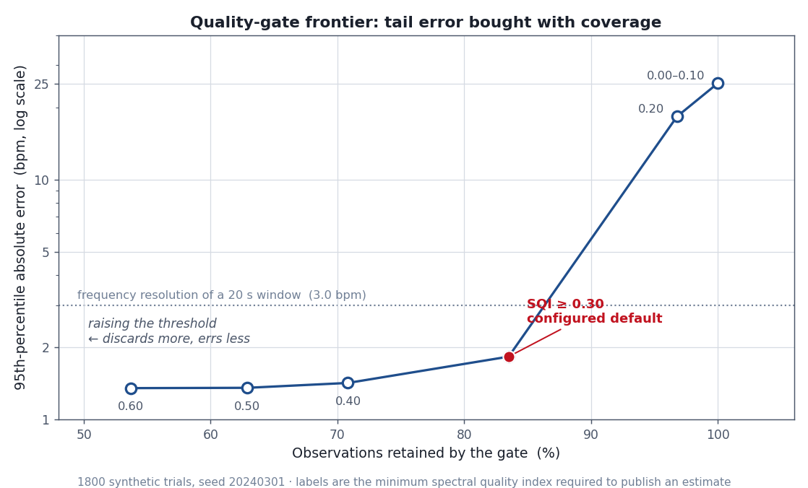

# 自适应学习投入度监测系统

[English](README.md) · **简体中文**

<p align="center">
  <a href="https://rover-de.github.io/adaptive-learning-engagement-monitor/"><strong>打开结果页</strong></a>
  · 关键数字与质量门限前沿图，无需安装
</p>

用一个普通的电脑摄像头估计心率与逐搏心率变异，再把它们转成一路**经质量门限筛选**的投入度信号，供下游消费者使用。

生理学只是载体，真正可迁移的是这个工程问题：从噪声里提取周期信号，在**发布之前**先量化这个估计有多不可靠，并且在证据不足时拒绝给出一个看起来很自信的数字。

<p align="center"><em>摄像头 → 信号处理 → 质量筛选 → 投入度状态 → JSON 接口</em></p>

---

## 这个项目为什么值得量化背景的人一看

领域是远程光电容积描记（rPPG），但内核是**低信噪比下的信号估计** —— 与从市场数据里提取一个微弱预测信号，是同一类问题。

| 本项目中的组件 | 对应的问题 |
| :---: | :---: |
| 频谱质量指数被用作**闸门**而非输出 | 只在信号置信度越过阈值时才交易；工作点落在一条精度/覆盖率前沿上 |
| 状态标签需连续 3 次确认才翻转 | 用滞回抑制阈值边界附近的换手 |
| RMSSD = 心搏间期序列一阶差分的均方根 | 与用收益率序列算已实现波动率结构完全相同，也继承了同样的离群点敏感性 |
| 延迟统计 p50/p95/p99，从不用均值 | 尾部延迟才是丢帧的原因，而丢帧会让频率估计产生偏差 |
| 所有影响数值的常量集中在一个冻结配置对象里，单一主随机种子 | 结果逐位可复现 |

下面最重要的那个结论是一个**负面结果**，我把它写出来而不是藏起来。

---

## 实测结果

所有数字都来自合成信号 —— 其真实心率与真实 RMSSD 由构造方式已知，因此误差是对照**真值**衡量的，而不是对照另一个估计器。**这验证的是数值链条，不是生理测量本身**：本仓库既没有血氧仪参照，也没有带标注的人体数据。详见[已知局限](#已知局限)。

逐位复现全部结果：

```bash
python -m benchmarks.validate_hr_accuracy   # 表格与结果 JSON
python -m benchmarks.plot_results           # 图表；需要 requirements-dev.txt
```

绘图步骤只读已提交的 JSON，绝不重跑扫描，所以图与旁边的数字在数学上不可能不一致。

1800 次试验 · 随机种子 `20240301` · 20 秒窗口 @ 30 fps · 通带 0.70–3.00 Hz（42–180 bpm）。已提交的输出：[`benchmarks/results/hr_accuracy.json`](benchmarks/results/hr_accuracy.json)。

全文使用的误差容限是 **3.0 bpm**，这不是随便选的偏好 —— 20 秒窗口的周期图能分辨 1/20 Hz，换算就是 3.0 bpm。声称精度细于窗口自身的频率分辨率，是没有意义的。

### 1. 心率精度随噪声的变化

频域估计，每个噪声档位 200 次试验：

| 信噪比 (dB) | 平均 SQI | MAE (bpm) | RMSE (bpm) | 偏差 (bpm) | 落在 3 bpm 内 |
| :---: | :---: | :---: | :---: | :---: | :---: |
| −20 | 0.261 | 19.13 | 28.40 | +11.58 | 34.0% |
| −15 | 0.302 | 9.24 | 19.88 | +4.96 | 72.5% |
| −12 | 0.379 | 1.40 | 4.93 | +0.57 | 95.5% |
| −9 | 0.510 | 0.55 | 0.85 | +0.06 | 99.5% |
| −6 | 0.636 | 0.45 | 0.59 | −0.01 | 100.0% |
| −3 | 0.743 | 0.44 | 0.60 | −0.03 | 100.0% |
| 0 | 0.821 | 0.40 | 0.58 | +0.01 | 100.0% |
| +3 | 0.867 | 0.44 | 0.63 | −0.03 | 100.0% |
| +6 | 0.899 | 0.41 | 0.59 | −0.01 | 100.0% |

这张表有两点值得读出来。**转变是陡的，不是渐进的**：从 −15 dB 到 −12 dB，命中率从 72.5% 跳到 95.5%，说明性能取决于脉搏峰是否压得住它的邻域，而不是以任何平滑方式取决于噪声水平。**其次，估计器失效时的偏差严格为正**（−20 dB 处 +11.58 bpm）—— 真峰一旦丢失，argmax 会落到通带里别的地方，而通带一直延伸到 180 bpm，所以失效是不对称的、偏向高估。只看平均绝对误差会完全掩盖这一点。

### 2. 质量门限才是真正的贡献

频谱质量指数衡量的是带内功率在主峰附近的集中程度。它不作为特征输出，而是决定这个估计**是否值得发布**。提高阈值买到精度，代价是覆盖率：

<p align="center">
  
</p>

形状本身就是结论。存在一个**肘部**，越过它曲线急剧变平：继续收紧几乎买不到精度，却持续损失覆盖率。汇总全部 1800 次试验：

| SQI 下限 | 保留观测 | MAE (bpm) | RMSE (bpm) | p95 绝对误差 | 落在 3 bpm 内 |
| :---: | :---: | :---: | :---: | :---: | :---: |
| 0.00 | 100.0% | 3.61 | 11.68 | 25.20 | 89.1% |
| 0.10 | 100.0% | 3.61 | 11.68 | 25.20 | 89.1% |
| 0.20 | 96.8% | 2.91 | 10.17 | 18.31 | 91.1% |
| **0.30** | **83.5%** | **1.28** | **5.96** | **1.83** | **97.1%** |
| 0.40 | 70.8% | 0.56 | 2.34 | 1.42 | 99.7% |
| 0.50 | 62.9% | 0.49 | 1.62 | 1.36 | 99.8% |
| 0.60 | 53.7% | 0.43 | 0.61 | 1.35 | 100.0% |

配置的默认值 0.30 丢弃了 16.5% 的观测，换来的是 95 分位绝对误差从 **25.20 bpm 降到 1.83 bpm** —— 用六分之一的样本量，把尾部压缩了 13.8 倍。这是本仓库里最有价值的一行。

还有一点值得注意：p95 误差的塌缩远快于 RMSE —— 同一阈值下 RMSE 仍有 5.96 bpm。这说明门限擅长剔除**典型的**坏估计，对罕见的灾难性估计则弱得多，因此过滤后的残余风险集中在一条细尾巴上。真正在意最坏情况的消费者应该把门限提到 0.40 以上，并接受 70.8% 的覆盖率。

阈值从 0.00 提到 0.10 完全没有变化：带限噪声本身的 SQI 就约为 0.13，所以不存在任何低于 0.10 的可实现观测。前沿曲线上那段水平线是这个指标的性质，不是测量假象。

### 3. 心搏定位：相位穿越在关键区间胜过峰值提取

RMSSD 要求定位到每一次心搏，而一个局部极大值只由三个采样点决定 —— 它的位置因此继承了这三点上的全部噪声。替代方案是跟踪解析信号的**瞬时相位**，它由整个周期共同决定。两种方法在每次试验中都跑在**同一个**缓冲区上，所以这是一次配对比较。

时域心率的平均绝对误差（bpm）：

| 信噪比 (dB) | 相位穿越 | 峰值提取 | 优者 |
| :---: | :---: | :---: | :---: |
| −20 | 18.58 | 19.02 | 相位 |
| −15 | 9.84 | 10.04 | 相位 |
| −12 | 2.10 | 2.22 | 相位 |
| −9 | 0.74 | 0.79 | 相位 |
| −6 | 0.39 | 0.38 | 峰值，微弱 |
| 0 | 0.26 | 0.23 | 峰值，微弱 |
| +6 | 0.24 | 0.20 | 峰值，微弱 |

**交叉点才是重点**：干净信号下峰值提取略胜，噪声信号下相位跟踪取胜。由于摄像头 rPPG 恰好工作在低信噪比区间，`phase` 被设为默认值 —— 而定这个默认值的依据是基准测试，不是直觉。在经门限筛选的 RMSSD 上，差距则毫无悬念（见下节）。

### 4. 负面结果：RMSSD 不携带可用的截面信息

经门限筛选的观测（SQI ≥ 0.30，n = 1503）：

| 方法 | MAE (ms) | RMSE (ms) | 偏差 (ms) | 与真值的皮尔逊 r |
| :---: | :---: | :---: | :---: | :---: |
| 相位穿越 | 28.3 | 37.2 | +14.5 | **0.046** |
| 峰值提取 | 31.3 | 40.9 | +19.5 | 0.033 |

相位跟踪在每一列上都优于峰值提取，这佐证了默认配置。但真正要紧的是最后一列：**对照已知真值 r ≈ 0.05，与"毫无关系"无法区分。** 在同一批经门限筛选的观测上，估计器把心率恢复到了 2 bpm 以内，却完全无法恢复变异性。

这不是调参问题，原因是结构性的。心率是积分频谱的属性，所以 20 秒窗口的平均对它有帮助；RMSSD 是相邻间期之差的函数，窗口平均帮不上忙 —— 而在 30 fps 下每个心搏时刻被量化到 33 ms，这个量化误差会在每个间期差里出现两次。代码中已实现峰值位置的亚采样抛物线插值来挽回一部分，但仍然不够。+14.5 ms 的正偏差与"残余计时噪声抬高一个均方根统计量"完全吻合 —— 就像用含噪价格计算已实现波动率时会被抬高一样。

诚实的结论：**`RegimeConfig` 里的疲劳阈值，建立在一个本管线目前测不准的输入之上。** 它们留在代码里是作为一个有文档的接口，明确**不是**一个已验证的结论。要修好这一点需要更高帧率或真正更好的心搏计时估计器，而不是换一组阈值。

### 5. 延迟

估计器与采集帧率解耦，以 1 Hz 重新求值，因此其开销不随帧率增长。在一个完整的 586 采样窗口上（Apple 芯片，Python 3.9，n = 300 次求值）：

| p50 | p95 | p99 | 最大 |
| :---: | :---: | :---: | :---: |
| 1.41 ms | 1.68 ms | 1.91 ms | 2.27 ms |

实时管线的各阶段分位数 —— 读帧、人脸检测、眼部检测、估计、端到端 —— 通过 `/metrics` 暴露，并在监控台上呈现。用分位数而不用均值，因为一条均值 8 ms、但每五十帧就卡到 90 ms 的管线是会丢帧的，而丢帧会让频率估计产生偏差。

---

## 快速开始

需要 Python 3.9+、一个摄像头，以及授予终端的摄像头权限。

```bash
git clone https://github.com/Rover-de/adaptive-learning-engagement-monitor.git
cd adaptive-learning-engagement-monitor

python3 -m venv .venv
source .venv/bin/activate          # Windows: .venv\Scripts\Activate.ps1
pip install -r requirements.txt

python main.py
```

然后打开 <http://127.0.0.1:5050/>。心率会在缓冲区达到 `min_window_seconds`（8 秒）后出现，约 20 秒后趋于稳定。

**没有摄像头？** 全套基准测试可无头运行，既不需要摄像头也不需要 Flask 服务：

```bash
python -m benchmarks.validate_hr_accuracy
```

可选参数：

```bash
python main.py --camera 1              # 指定其他采集设备
python main.py --port 8080             # 换绑端口
python main.py --window-seconds 30     # 更长的窗口：分辨率更细，滞后更大
```

窗口长度是核心的权衡。频率分辨率为 `60 / window_seconds` bpm，所以 30 秒能分辨 2.0 bpm 而非 3.0 bpm，代价是对变化的响应更慢。

---

## API

| 端点 | 返回 |
| :---: | :---: |
| `GET /` | 监控台页面 |
| `GET /status` | 当前投入度快照（JSON） |
| `GET /metrics` | 各阶段延迟分位数与吞吐量（JSON） |
| `GET /video_feed` | 带标注的 MJPEG 预览流 |
| `GET /static/lesson_player.html` | 可选 demo：根据发布的状态自适应调整视频播放 |

```jsonc
// GET /status
{
  "regime": "ENGAGED",            // 经滞回后发布的标签
  "raw_regime": "MILD_FATIGUE",   // 瞬时分类结果，用于诊断
  "regime_flips": 3,              // 累计发布的状态转换次数 —— 换手的类比量
  "hr_bpm": 72.4,                 // 频域估计；优先使用这个
  "hr_peak_bpm": 71.9,            // 时域估计，来自心搏间期
  "rmssd_ms": 34.1,               // 采信之前请先看上面的负面结果
  "sqi": 0.71,                    // 低于 RegimeConfig 的门限时，状态转为 INSUFFICIENT_DATA
  "blink_rate_per_min": 14.0,
  "effective_fps": 29.7,
  "face_locked": true
}
```

所有数值字段都可为 `null`。`null` 表示估计器**拒绝发布** —— 这是一个有意义的答案，不是错误状态。

---

## 值得为之辩护的设计决策

**按真实时间戳重采样。** 摄像头的帧到达时间是抖动的。假设帧周期恒定会直接在频率轴上引入偏差，因此缓冲区是用实测到达时间插值到均匀网格上的。

**零相位滤波。** 巴特沃斯带通做前向-后向两遍。因果滤波器的群延迟会平移心搏时刻，而心搏时刻恰恰是 RMSSD 的计算依据。

**在窄带里定位心搏，而不是在整个通带里。** 在 0.70–3.00 Hz 全带上找峰，正是幼稚实现产出不可用 HRV 的原因：宽带噪声和波形自身的二次谐波都会造出伪峰，而每一个伪峰都会把一个间期劈成两个。心搏定位只在围绕已估出的脉搏频率 ±0.40 Hz 重新滤波之后才进行。

**丢弃离群间期，而不是做缩尾。** 漏检一次心搏会让间期翻倍，多出一个伪峰会让间期减半。两者都会主导一个平方型统计量，也都不代表生理事实，所以直接剔除，而不是向中位数收缩。

**单一写者。** 采集线程独占摄像头和全部估计器状态；Web 层在锁的保护下读取不可变快照，从不接触估计器对象。

**限制 MJPEG 流的帧率并跳过未变化的帧。** 那种想当然的实现 —— 循环、把缓冲区里的东西重新编码一遍 —— 会让一个核心每秒做几百次冗余 JPEG 编码，把采集线程饿死，而这会直接表现为估计器的丢帧。

---

## 仓库结构

```
alems/
  config.py       所有影响数值的常量，装在冻结的 dataclass 里
  rppg.py         信号链：重采样、去趋势、滤波、频谱、心搏
  blink.py        基于时长门控的眨眼检测，输入是二值可见性流
  engagement.py   特征 → 状态分类，带滞回
  metrics.py      滚动延迟分位数
  pipeline.py     采集线程；估计器状态的唯一写者
  server.py       只读 Flask API
  synthetic.py    基准测试使用的真值信号生成器
benchmarks/
  validate_hr_accuracy.py   上面那些表格
  plot_results.py           从 JSON 渲染前沿图
  results/hr_accuracy.json  已提交的输出
  results/sqi_frontier.png  已提交的图表
static/
  dashboard.html            监控台
  lesson_player.html        可选的自适应播放 demo
main.py
requirements.txt            运行时依赖
requirements-dev.txt        额外加 matplotlib，仅用于绘图
docs/                       静态结果页（GitHub Pages）
```

估计器消费的是 `(数值, 时间戳)` 对，对人脸、帧、摄像头一无所知。正是这种解耦，让整条数值链条能够对照合成真值做测试。

---

## 已知局限

直说，因为只报告自己赢了的基准测试不算基准测试。

- **验证是合成的。** 真值来自生成器，所以上面的数字界定的是估计器的数值行为，不是基于摄像头的生理测量精度。这里没有血氧仪对照。
- **RMSSD 不可用。** 对照已知真值 r ≈ 0.05。上文已完整说明；依赖它的疲劳判据在构造上就是未经验证的。
- **状态阈值是演示值。** 未在带标注的人体数据上拟合。不具备任何临床、诊断或心理测量学效力。
- **Haar 级联是个薄弱的前端。** 眨眼检测靠级联检测器的丢失来推断闭眼。时长门控与不可再触发期消除了主要的假阳性模式，但基于关键点的眼睛纵横比（EAR）会严格更好。
- **单人、正面、相对静止。** 取检测到的最大人脸。头部运动和光照变化都会劣化 ROI 信号，此时质量门限会正确地拒绝发布。
- **没有拉取式背压。** `/video_feed` 的慢消费者是靠跳帧处理的，不是靠流控。

